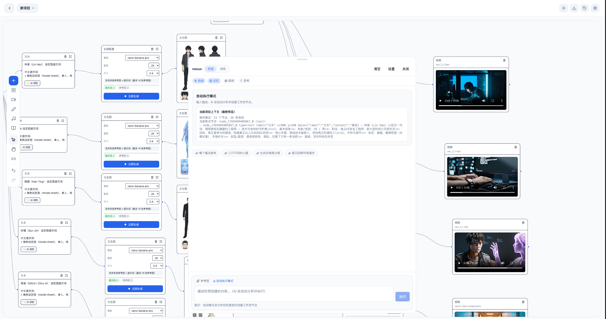
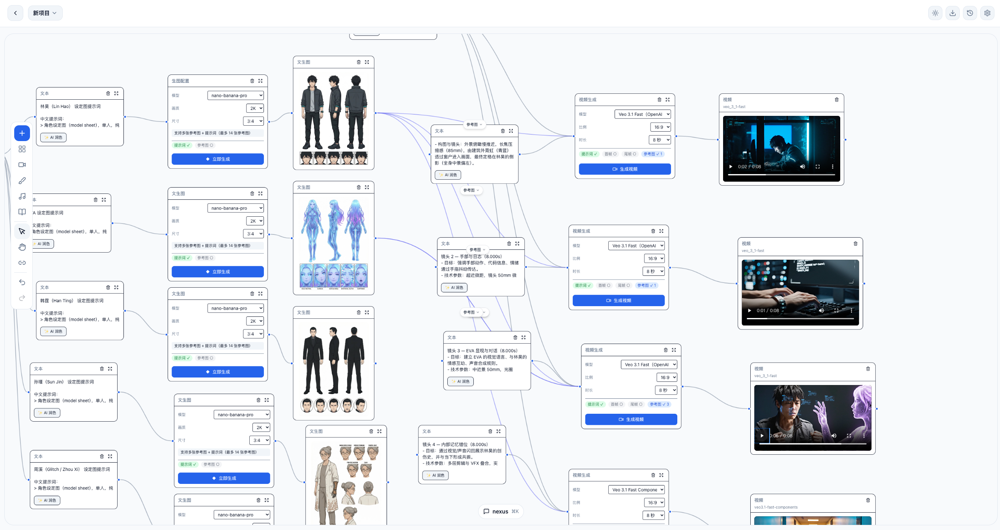

# Nexus

  
  

**Nexus** 是一款强大的 AI 工作流画布应用，让你轻松创建文生图、图生视频等 AI 创作工作流。

---

## 功能特性

- **可视化节点画布** - 拖拽式操作，直观创建工作流
- **文生图工作流** - 支持多种主流 AI 绘图模型
- **图生视频工作流** - 一键将静态图片转为动态视频
- **智能 AI 助手** - 内置对话助手，辅助创作
- **高性能渲染** - GPU/DOM 自动切换，流畅体验
- **本地存储** - 数据保存在本地，隐私安全

---

## 下载安装

### 最新版本: v0.0.24

| 平台 | 下载链接 | 说明 |
|------|----------|------|
| **macOS (Intel)** | [Nexus_0.0.24_x64.dmg](https://github.com/cookiesen77-rgb/nexus-source/releases/download/v0.0.24/Nexus_0.0.24_x64.dmg) | 适用于 Intel 芯片 Mac |
| **macOS (Apple Silicon)** | [Nexus_0.0.24_aarch64.dmg](https://github.com/cookiesen77-rgb/nexus-source/releases/download/v0.0.24/Nexus_0.0.24_aarch64.dmg) | 适用于 M1/M2/M3 芯片 Mac |
| **Windows (EXE)** | [Nexus_0.0.24_x64-setup.exe](https://github.com/cookiesen77-rgb/nexus-source/releases/download/v0.0.24/Nexus_0.0.24_x64-setup.exe) | Windows 安装程序 |
| **Windows (MSI)** | [Nexus_0.0.24_x64_en-US.msi](https://github.com/cookiesen77-rgb/nexus-source/releases/download/v0.0.24/Nexus_0.0.24_x64_en-US.msi) | Windows MSI 安装包 |

[查看所有版本](https://github.com/cookiesen77-rgb/nexus-releases/releases)

---

## 获取 API Key

  <b>使用 Nexus 需要配置 API Key 才能使用 AI 功能</b>

  

### 获取步骤：

1. 访问 **[nexusapi.cn](https://nexusapi.cn/)**
2. 注册/登录账号
3. 在控制台获取你的 API Key
4. 打开 Nexus 应用，进入设置页面
5. 粘贴 API Key 并保存

### 为什么选择 nexusapi.cn？

- **稳定可靠** - 高可用 API 服务
- **多模型支持** - GPT、Gemini、DALL·E、Midjourney 等
- **价格实惠** - 按量计费，无月费
- **中文优化** - 针对中文场景优化

[查看价格方案](https://nexusapi.cn/pricing)

---

## 系统要求

### macOS
- macOS 10.15 (Catalina) 或更高版本
- Intel 或 Apple Silicon 处理器

### Windows
- Windows 10 (1803) 或更高版本
- x64 处理器

---

## 应用截图

### AI 助手与工作流画布

  

  <i>智能 AI 助手，自动执行工作流创建</i>

### 完整工作流示例

  

  <i>可视化节点画布，从文生图到图生视频的完整工作流</i>

---

## 更新日志

### v0.0.24
- **修复自动更新** - 修正更新检测 endpoint 和下载链接

### v0.0.23
- **导演台一键生成** - 点击"一键生成"自动润色提示词并生成图片
- **修复导演台生图** - 支持 Gemini、Kling、Chat 等多种模型格式
- **新增电商预设** - 电商主图、产品多角度、模特展示、场景图等
- **新增场景四角度预设** - 2x2 网格展示同一场景的 4 个经典机位

### v0.0.22
- **启用自动更新** - 应用启动时自动检测新版本，可一键更新
- **更新通知** - 有新版本时显示更新横幅，支持手动安装

### v0.0.21
- **更新产品图标** - 全新黑猫透明背景图标
- **统一 AI 模型** - AI 润色和 AI 助手使用相同模型 (gpt-5-mini)

### v0.0.20
- **修复 Windows 图片黑边** - 预览和下载使用原始 HTTPS URL

### v0.0.19
- **修复视频下载** - 解决视频下载失败问题
- **支持更多 CDN** - 放宽 HTTP 权限限制
- **启用开发者工具** - 支持 Cmd+Option+I 打开调试

### v0.0.18
- **新增图片编辑工具栏** - 悬停图片节点显示快捷编辑工具
- **姿态变换** - AI 润色提示词改变人物姿态
- **角度变换** - AI 润色提示词改变拍摄角度
- **四宫格/九宫格裁剪** - 无损裁剪生成多张图片节点
- **扩图** - AI 分析图片自动扩展边界
- **抠图** - 提取指定对象，透明背景
- **擦除** - 移除指定对象，智能填充

### v0.0.17
- **下载路径选择** - 下载时弹出文件保存对话框，可选择保存位置
- **修复裁剪边缘问题** - 修复 Windows 上裁剪图片边缘有瑕疵的问题
- **裁剪精度优化** - 使用整数坐标，禁用图像平滑

### v0.0.16
- **图片节点上传功能** - 从工具栏添加图片/视频/音频节点时弹出文件选择器
- **深色模式下拉框适配** - 修复选择模型时文字颜色不反转的问题

### v0.0.15
- **修复主页删除功能** - 使用自定义弹窗替代 window.confirm
- **新增项目备注功能** - 可为项目添加描述备注
- **优化时间戳显示** - 处理异常时间戳值

### v0.0.14
- **新增应用内预览** - 图片/视频预览现在在应用内模态框显示
- **修复下载功能** - 下载现在可靠工作，保存到默认下载目录
- **修复裁剪遮罩** - 使用 clip-path 实现，无重叠问题
- **修复提示词库按钮** - "插入"按钮不再被截断

### v0.0.13
- **下载功能优化** - Tauri 环境现在会弹出系统文件保存对话框
- **裁剪流畅度优化** - 使用 requestAnimationFrame 优化拖动性能
- **预览功能统一** - data URL 新窗口显示，HTTP URL 系统浏览器打开
- **新增文件系统支持** - 添加 Tauri dialog 和 fs 插件

### v0.0.12
- **修复裁剪拖动问题** - 裁剪框现在可以正常拖动和缩放
- **修复图片/视频下载** - 支持 Tauri 和 Web 环境
- **修复图片/视频预览** - data URL 支持新窗口显示
- **优化用户反馈** - 所有操作添加成功/失败提示

### v0.0.11
- **新增图片裁剪功能** - 支持自由裁剪和预设比例（1:1, 4:3, 16:9 等）
- **修复批量下载** - 现在能正确显示所有画布资源
- **UI 风格统一** - 弹窗样式保持一致

### v0.0.10
- **新增工作流模板** - 漫画分镜、多角度分镜模板
- **新增导演台** - AI 智能生成分镜脚本
- **新增草图编辑器** - 涂鸦生图/生视频
- **新增音频工作室** - Suno 文生音乐
- **新增提示词库** - 运镜/Nano Banana/漫画模板

### v0.0.9
- 新增提示词库功能
- 修复侧边栏按钮状态

### v0.0.8
- 修复应用启动崩溃问题
- 优化构建流程

### v0.0.7
- 修复批量下载和历史面板功能
- 修复 Tauri 环境中的图片/视频生成问题

### v0.0.6
- **修复桌面端无法生成图片/视频的问题** (load failed)
- 使用 Tauri HTTP 插件绕过 CORS 限制

### v0.0.5
- 默认切换为浅色主题
- 项目独立聊天记录
- 修复模型选择不一致的 bug
- 移除 Base URL 配置项
- 添加 GitHub Actions 自动构建
- 支持 macOS (Intel/ARM) 和 Windows

---

## 许可证

本软件仅供个人使用。

---

## 相关链接

| 链接 | 说明 |
|------|------|
| [nexusapi.cn](https://nexusapi.cn/) | API 服务官网 |
| [价格方案](https://nexusapi.cn/pricing) | 查看定价 |

---

  <b>Powered by <a href="https://nexusapi.cn/">nexusapi.cn</a></b>

